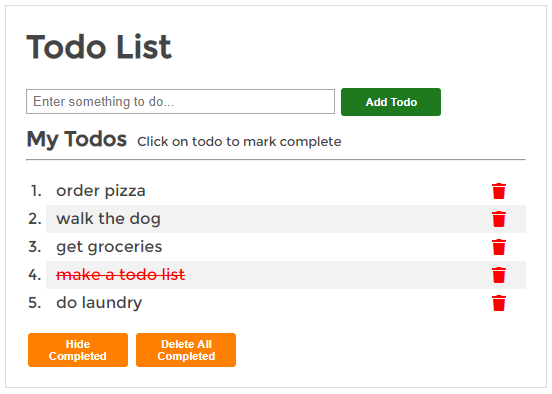

# Simple Todo

_Just another todo list_

You can see it in action [here](https://rahbuhkeh.dev/simple_todo/)

## Summary
The Simple Todo app is just a todo list that is built with vanilla JS and uses localStorage for persistance. 

I built this todo list to test my basic JS knowledge. Not too long ago, if I were asked to build a simple application such as this, I would have froze like a deer in headlights without a clue of where to begin. This project helped me see how much I have progressed because it took me very little time to code the initial app. I have since done a little refactoring to DRY up the code.

&nbsp;&nbsp;
&nbsp;&nbsp;
&nbsp;&nbsp;

## Author
Rob Kramer
Full-Stack Developer